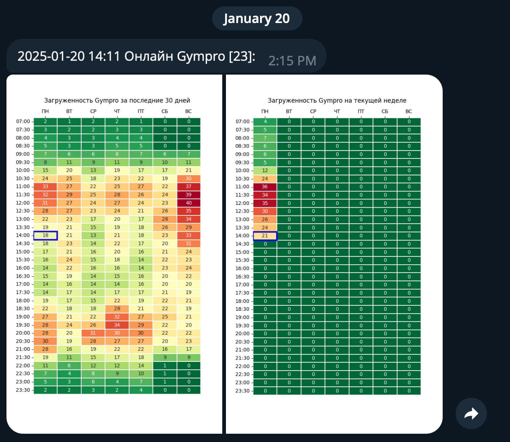

# Gym Online Checker Bot
Telegram-бот для анализа загруженности фитнес-зала на основании тепловых карт (heatmap)

Может быть полезно для того, чтобы:
- Быстро узнать, сколько людей находится в зале в разное время дня и недели.
- Легче планировать тренировки, выбирая часы с минимальной загруженностью.
- Избегать пиковых нагрузок и проводить занятия в комфортной обстановке.
- Анализировать загруженность зала за текущую неделю или за последние 30 дней, чтобы подобрать наиболее подходящее время.

## Описание
Проект позволяет создавать тепловые карты с загруженностью зала на основе данных за:
- Последние 30 дней (для снижения влияния сезонности)
- Текущую неделю 

**Особенности:**
- Цветовая кодировка: зеленый для низкой загруженности, красный для высокой
- Текущая ячейка времени выделена синим квадратом
- Удобство интеграции с Telegram

**Пример сообщения в Telegram-боте**

## Основные файлы проекта

### `gym_online_get_online.py`
Этот скрипт отвечает за автоматическую загрузку данных о текущей загруженности зала:
- Использует Selenium для получения данных с сайта Gym
- Сохраняет данные в базу данных PostgreSQL для дальнейшего анализа
- Выполняется по расписанию с использованием cron-заданий

### `gym_online_sent.py`
Этот скрипт используется для генерации и анализа тепловых карт загруженности. Он обрабатывает данные, поступающие из базы данных, и строит визуализации. Скрипт формирует данные в виде графиков, которые  отправляются в Telegram.